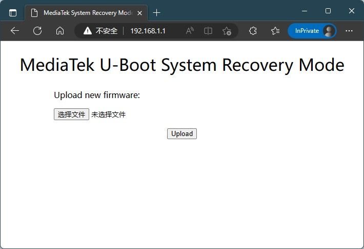

# MediaTek MT7621 U-Boot with Failsafe Mode

## Online Build

1. Fork This Repository.

2. Click `Actions` then choose `Build customized u-boot`.

3. Click `Run workflow` and set board specific parameters.

4. U-Boot image will be uploaded to Artifacts.

## Board Parameters

**Flash Type**  
NOR Flash / NAND Flash / NAND Flash with NMBM support

**MTD Partition Table**  
example: `192k(u-boot),64k(u-boot-env),64k(factory),-(firmware)`  
notice: `u-boot` and `firmware` partitions are essential

**Kernel Load Address**  
equal to the sum of all partition size before `firmware` in hexadecimal

**Reset Button GPIO**  
GPIO pin number of the reset button  
notice: if not set, you can't press reset button to enter failsafe mode

**System LED GPIO**  
GPIO pin number of the status LED  
notice: if not set, status LED won't blink when you press reset button

**CPU Frequency**  
default value is 880 (MHz).  
notice: Overclock may cause the system to fail to boot or overheat.

**DRAM Frequency**  
default 800 (MT/s) for DDR2 and 1200 (MT/s) for DDR3.  
notice: if your board is unstable, try lowering it.

**Prefered DDR Init Parameters**  
DRAM specific model or type and size  
notice: DDR3-128MiB-KGD is for MT7621DAT (internal integrated 128MiB RAM)

**Use Old DDR Timing Parameters**  
DDR Timing Parameters used in ralink U-Boot 1.1.3  
notice: do not select it if your board is working properly

**Baud Rate**  
TTL serial port baud rate, 57600 or 115200

## Usage

1. Flash `u-boot-mt7621.bin` into board.

2. Set computer IP address to `192.168.1.2` and Netmask to `255.255.255.0`.  
   Gateway `192.168.1.1` is optional.

3. Remove the power supply, press and hold the reset button, plug in the  
   power supply. And then you can choose:

   a) Release the button after the status LED blinks at least 1 second  
   (blink 5 times), then you will enter into WebUI recovery mode. You can  
   open http://192.168.1.1 in the browser to upload firmware.

   b) Hold the button until the status LED no longer blinks (blink 6 seconds  
   in total), then you will enter into TFTP download mode. You can upload  
   **initramfs** kernel image `recovery.bin` via TFTP server such as tftpd64.
